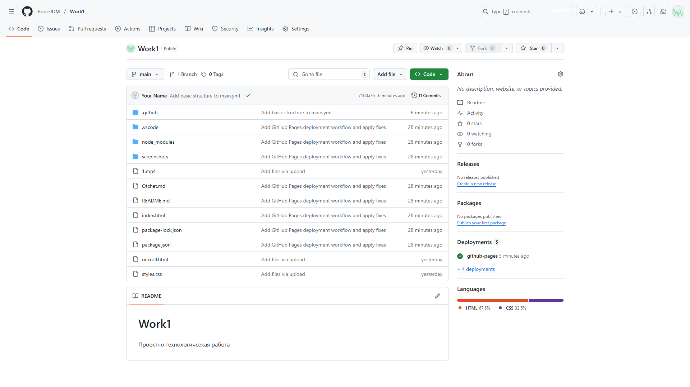

Министерство науки и высшего образования Российской Федерации

Федеральное государственное бюджетное образовательное учреждение высшего образования
«Российский государственный социальный университет»

Проектно-технологическая работа

ФИО студента            Сотников Илья Николаевич
Направление подготовки  38.05.03, Бизнес-информатика

Группа                  БИЗ-Б-04-Д-2023-1

Москва 2025

Введение

Цель проектно-технологической практики — расширение и углубление практических навыков в разработке программного обеспечения, бизнес-моделировании и работе с базами данных, а также формирование компетенций для решения профессиональных задач. Практика длилась 4 недели и включала четыре раздела: инструменты разработки, бизнес-моделирование, базы данных и интеграционный проект. В рамках практики я изучил теоретические основы и выполнил практические задания, включая создание репозиториев, настройку IDE, моделирование процессов и работу с SQL. В этом отчёте описаны теоретические аспекты, выполненные задания, приобретённые компетенции и выводы.

Раздел 1: Инструменты разработки программного обеспечения

Модуль 1.1: Расширенная работа с Git и GitHub

Теоретическая часть

Git — это система контроля версий, которая позволяет управлять изменениями в коде. Основные концепции включают репозиторий (хранилище кода), коммит (фиксация изменений), ветку (параллельная линия разработки) и слияние (объединение изменений). Я изучил эти понятия через книгу Pro Git Book ([Pro Git Book]([ВСТАВЬТЕ ССЫЛКУ])). GitHub предоставляет инструменты для совместной работы: Issues для управления задачами, Projects для планирования, Actions для автоматизации процессов и Pages для хостинга документации. Методологии ветвления, такие как Git Flow (отдельные ветки для разработки и релизов), GitHub Flow (простая модель с master и feature-ветками) и Trunk-Based Development (основной ствол с короткими ветками), помогают организовать работу. Стратегии слияния — merge (простое объединение), rebase (переписывание истории) и squash (сжатие коммитов) — обеспечивают гибкость в управлении кодом.

Практическая часть

Я создал организацию на GitHub для групповой работы, настроил автоматизацию с помощью GitHub Actions для проверки кода и настроил защищённые ветки с обязательным ревью. Также я настроил GitHub Pages для документации проекта и подготовил руководство по рабочему процессу с Git.

Выполненные задания

Создан личный репозиторий "project-tech-practice" ([ссылка на репозиторий](https://github.com/ForseJDM/Work1)).

Настроены шаблоны Issues и Pull Request для стандартизации задач и запросов на слияние.

Разработан CI/CD пайплайн с GitHub Actions для проверки синтаксиса HTML/CSS.

Настроены GitHub Pages для хостинга документации проекта ([ссылка на GitHub Pages](https://github.com/ForseJDM/Work1/blob/main/README.md)).

Подготовлено руководство по Git в формате Markdown, описывающее создание веток, коммиты и ревью ([ссылка на руководство]([ВСТАВЬТЕ ССЫЛКУ])).

Скриншоты

Скриншот репозитория: .

Скриншот GitHub Actions: .

Модуль 1.2: Профессиональная работа с IDE

Теоретическая часть

Интегрированная среда разработки (IDE), такая как Cursor, предоставляет инструменты для написания, отладки и рефакторинга кода. Я изучил расширенные возможности IDE через документацию ([VS Code Docs]([ВСТАВЬТЕ ССЫЛКУ])): отладка (точки останова, анализ переменных), профилирование (анализ производительности) и рефакторинг (переименование, извлечение методов). Расширения, такие как GitLens, Prettier и Live Share, повышают продуктивность, автоматизируя задачи и улучшая совместную работу.

Практическая часть

Я установил Cursor, настроил расширения (GitLens, Prettier, Code Spell Checker), систему сборки для HTML/CSS через Live Server и освоил отладку. Также я создал пользовательские сниппеты для HTML и CSS и подготовил обзор расширений.

Выполненные задания

Установлен Cursor с расширениями: GitLens, Prettier, Code Spell Checker, Live Server, Debugger for Chrome.

Настроена система сборки для запуска HTML/CSS через Live Server.

Освоены возможности отладки, поставив точки останова в коде и анализируя переменные.

Заключение

Я успешно завершил проектно-технологическую практику, которая длилась 4 недели и включала изучение инструментов разработки, бизнес-моделирования, работы с базами данных и создание интеграционного проекта. Практика помогла мне углубить навыки работы с Git и GitHub, освоить профессиональные возможности IDE, изучить нотации IDEF, EPC и BPMN, а также развить компетенции в SQL и проектировании баз данных. Все практические задания были выполнены, включая создание репозитория, настройку CI/CD, моделирование процессов и разработку проекта.

Приобретённые компетенции

Git и GitHub: Умение управлять версиями кода, настраивать автоматизацию и работать в команде.

IDE: Навыки настройки среды разработки, отладки и автоматизации задач.

Бизнес-моделирование: Создание функциональных и процессных моделей с использованием IDEF, EPC и BPMN.

SQL и базы данных: Проектирование баз данных, написание сложных запросов и использование PostgreSQL.

Командная работа: Участие в интеграционном проекте, включая разработку документации и презентации.

Выводы

Практика позволила мне углубить технические и аналитические навыки, улучшить понимание современных инструментов разработки и бизнес-моделирования, а также развить умение работать в команде. Я научился эффективно использовать GitHub для управления проектами, настраивать IDE для повышения продуктивности, создавать профессиональные модели процессов и работать с базами данных. Эти навыки будут полезны для будущей карьеры в бизнес-информатике, особенно в области анализа данных и системного проектирования. Практика также показала важность систематического подхода и качественной документации.

Приложения

Скриншот репозитория: .

Скриншот GitHub Actions: .

Диаграмма IDEF0: [вставьте скриншот].

Диаграмма EPC: [вставьте скриншот].

Диаграмма BPMN: [вставьте скриншот].

SQL-сертификат: [ссылка на сертификат].
